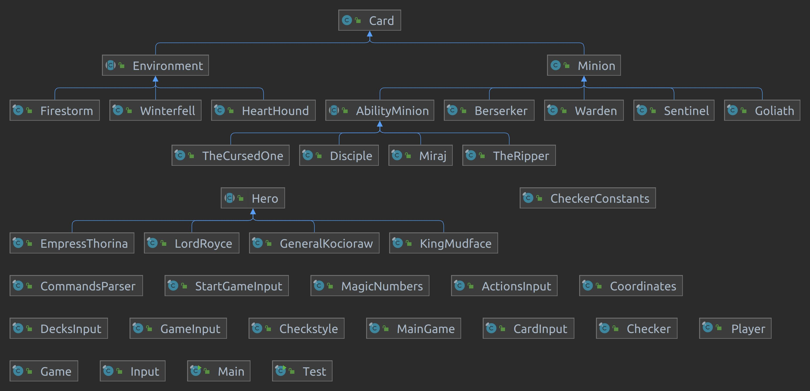

# GwentStone

<r>

# Rules of the Game

GwentStone is a game played by two players, where the goal is to defeat the enemy's Hero (more on these concepts later on). Each player is assigned with a deck and a Hero, and they place their cards on a 4x5 table, divided into two sections of two rows each. 
At the start of the game, each players draws a card from the deck. GwentStone is a turn-based game, where players can make cards placed on the table attack each other, or attack the enemy Hero. A turn ends when a player specifically mentions so. After both players ended their turn, they each draw a new card from their decks, and receive mana (currency used to place cards on the board).
Once one of the players defeats the enemy Hero, he is crowned victorious, and a new game can begin.

# Implementation

The project emphasises basic OOP concepts, while delivering a fun experience. In the following sections, I will describe the project's classes and how they are organized, and also detail the project's flow.

## Cards and Classes Hierarchy
  

There are three main types of cards:
- *Minion cards*: They are placed on the board and can attack other minions, the enemy Hero or use abilities.
- *Environment cards*: They have general effects on a row and cannot be placed on the board, being removed from the hand upon use.
- *Heroes*: They possess powerful abilities, but cannot be placed on the board. The goal is to keep your hero alive, while defeating the enemy's.

The Card class is the general class that describes them.

### Minion Cards

Minion cards are the ones a player can place on the board. There are two types of Minion cards:
standard cards (that can only attack other cards), and ability cards (that can also use an ability).

Minion class is the class describing them (and it inherits the Card class).

#### Standard Minions

There are four standard minions, as it follows:

- *Berserker* and *Sentinel*, which go on the back row
- *Goliath* and *Warden*, which go on the front row

Goliath and Warden also have a special trait, and they are called 'Tanks'. This means that if there's any Tank placed on the board, only they can be targeted by an attack.

Classes for each type of standard minion are organized in the standardMinions package.

#### Ability Minions

Just like the standard minions, there are four ability minions:

- *The Cursed One* (front row, **Shapeshift** ability)
- *Disciple* (back row, **God's Plan** ability)
- *Miraj* (front row, **Skyjack** ability)
- *The Ripper* (back row, **Weak Knees** ability)

Each ability is described in their corresponding JavaDoc comment.
Classes for each type of standard minion are organized in the standardMinions package. They all inherit the AbilityMinion abstract class (which iherits Minion class).

### Environment Cards

There are three types of Environment Cards, each having its own classes that inherit the Environment abstract class. The following are Environment cards:

- *Firestorm*
- *Winterfell*
- *HeartHound*

Their abilities affect an entire row. Each ability is described in their corresponding JavaDoc comment. Classes that describe environment cards are organized in the environmentCards package.

### Hero Cards

Heroes are cards that start with 30 health points, each having its own ability. There are four heroes, each described by a class that inherits the Hero abstract class.

- *Lord Royce*
- *Empress Thorina*
- *General Kocioraw*
- *King Mudface*

Their abilities affect an entire row. Each ability is described in their corresponding JavaDoc comment. All four classes are organized in the heroCards package.

## Utility Classes

There are several more classes that are used in the implementation of this project.

### Testing classes

Classes in the *fileio* package are used for getting data from input, such as each player's decks and Heroes.
Classes in the *checker* package were used for testing the project while implementing it.
Classes in the *main* package were used for running the tests. Here is the entry point of the project's implementation

### Implementation classes

The following are classes used to describe a match of GwentStone:

- *Player*: descirbes a player, his deck and his hero
- *Game*: describes a game of two players and the game table
- *MainGame*: describes a match of two players, that can consist of multiple games (implemented following Singleton pattern)
- *MagicNumbers*: a static class used for constants

The "brains" of the project is represented by the *CommandsParser* class. It contains all of the commands that can be recieved at input that describe a match between two players. These commands can be either debugging methods (such as displaying a player's hand, or all of the cards currently placed on the board) or action methods (like placing a card on the table, using the hero's ability, and other actions).

## How the project works

Data is passed from input under the form of JSON files. Upon recieveng them, the startMatch method is called, which represents the entry point of the project. Inside the method, a for-loop is iterated for each game of the match, where instances of the Game class are created, one per game.

For every game, each player is assigned a deck of cards and a Hero. Afterwards, another for-loop iterates through all of the commands recieved at input. For each command, a method is called from the CommandsParser static class.

Output is being passed by the same way as the input is recieved, and that is JSON files. Some commands (such as debugging commands) can produce output, but some don't have to, because they simply execute actions. Alternatively, actions can produce error output in case they do are not used as intended.
